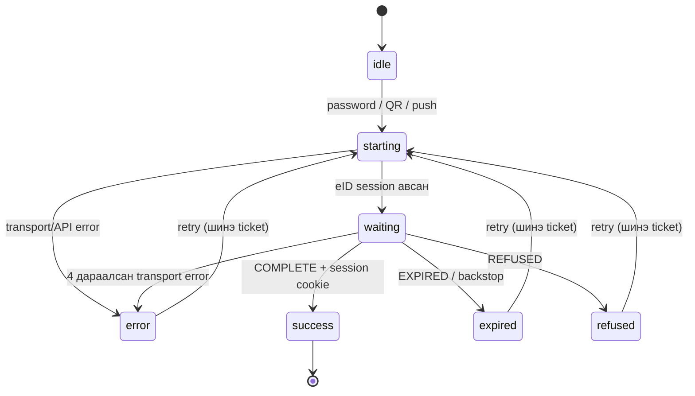

# Native Login specification v1.0

Энэ баримт нь Swift, C# болон Kotlin клиентүүдийн нэвтрэлтийн **зан төлөвийн
цорын ганц эх сурвалж**. Дэлгэц native байна; `/login` нь зөвхөн browser/PWA-д
ашиглагдана.

## Төлөвийн машин



Оролдлого бүр monotonic `ticket` авна. Cancel/retry хийхэд ticket нэмэгдэж,
хуучин callback UI төлөв өөрчлөх эрхгүй болно. Poll нь сервер дээр 25 секунд
хүртэл нээлттэй нэг хүсэлт; давхар poll хориглоно. Хариу бүрийн дараа 400 ms
хүлээнэ. Дараалсан гурван transport алдааг тэвчиж, дөрөв дэхэд `error` болно.
eID хугацаа өгөөгүй үед 15 минутын local backstop хэрэглэнэ.

## API урсгал

| Урсгал | Дуудлага | Амжилтын нөхцөл |
| --- | --- | --- |
| Нууц үг | `POST /api/v1/auth/login` `{email,password}` | `Set-Cookie: session_token` |
| eID QR/App2App | `POST /api/v1/auth/eid/start` `{callbackUrl}` | session + device link |
| eID push | `POST /api/v1/auth/eid/start-id` `{national_id,callbackUrl}` | session + verification code |
| eID poll | `POST /api/v1/auth/eid/poll` `{session_id}` | `COMPLETE` + session cookie |
| Session restore | `GET /api/v1/auth/me` | HTTP 200 |
| Logout | `POST /api/v1/auth/logout` | cookie цэвэрлэгдсэн |

HTTP client cookie-г өөрийн cookie jar-д хадгална. Амжилтын дараа зөвхөн
allowlisted API origin-оос ирсэн `session_token` cookie-г webview store руу
хуулж, `/apps` (эсвэл `/kiosk`, `/pos`) руу шилжинэ.

## Форм-фактор

- Desktop: password, native QR, registration-number push, biometric unlock.
- Mobile/tablet: password fallback, push, `device_link_url`-ыг системийн eID
  аппд нээх, universal/app link callback, biometric unlock.
- Kiosk: enrollment auto-session; citizen QR/push нь business flow дотор.
- POS: enrollment base session; employee PIN/card/biometric shift switch.

## Дэлгэцийн wireframe

```text
┌──────────────────────────────────────────────┐
│ Gerege Nexus                         MN ▾    │
│                                              │
│  Тавтай морил                                │
│  [ Регистр ] [ QR ] [ Админ ]                │
│                                              │
│  Регистрийн дугаар                           │
│  [ АА00112233                         ]       │
│  [ eID апп руу хүсэлт илгээх          ]       │
│                                              │
│  төлөв / verification code / retry           │
└──────────────────────────────────────────────┘
```

Брэндийн token: background `#0B0F17`, surface `#111827`, primary `#16A3A5`,
text `#F3F4F6`, danger `#DC2626`. Native accessibility, font scaling, keyboard
navigation, screen reader label-ийг платформ тус бүр дагана.

## Bridge lifecycle

`auth.reLogin` ажлын мужийг нууж native login гаргана. `auth.lock` нь local
unlock screen гаргах lifecycle method. Хэрэглэгч/ажилтан солигдсоны дараа shell
`shell:auth-changed` event-ийг `{reason,user_id?}` payload-тай илгээж, web тал
tenant data-г дахин татна. Эдгээр method/event capability шаардахгүй.
